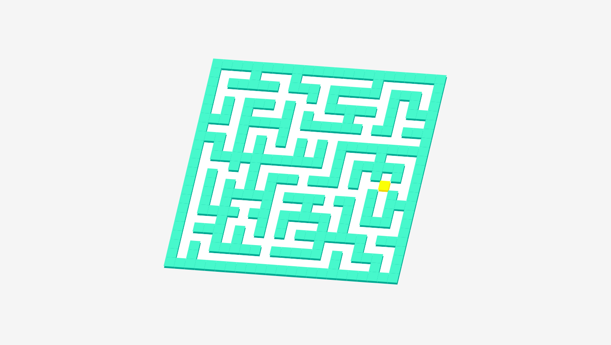

# Maze

Generate maze randomly and solve it in javascript from scratch.

## Installation

You only need browser and just clone the project and open [index.html](./index.html)

## Usage

This project generate maze randomly using [Randomized Kruskal's algorithm](https://en.wikipedia.org/wiki/Maze_generation_algorithm). At beginning, we see the maze building itself, and we see a small individual appear who can move in the maze. 

>This project is still under development, so there is no specific user goal yet.

## To do

- features
    - add beginning position and the exit for user
    - add level
- update
    - update animation
    - update design
- tools / code
    - add documentation
    - make test
    - using bundler to create bundle of this project

## Contributing

Pull requests are welcome. For major changes, please open an issue first to discuss what you would like to change.

Please make sure to update tests as appropriate.

## License

[ISC](./LICENSE.txt)